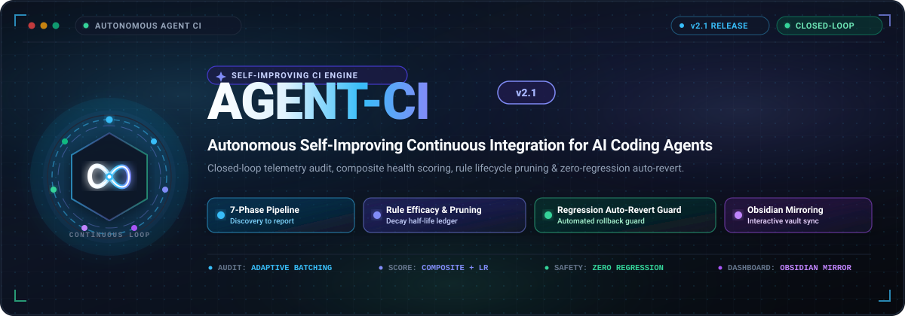
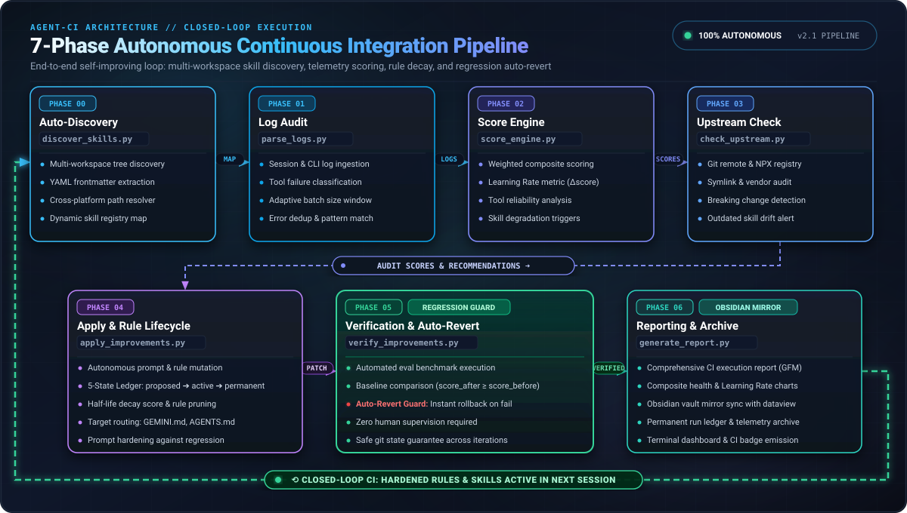
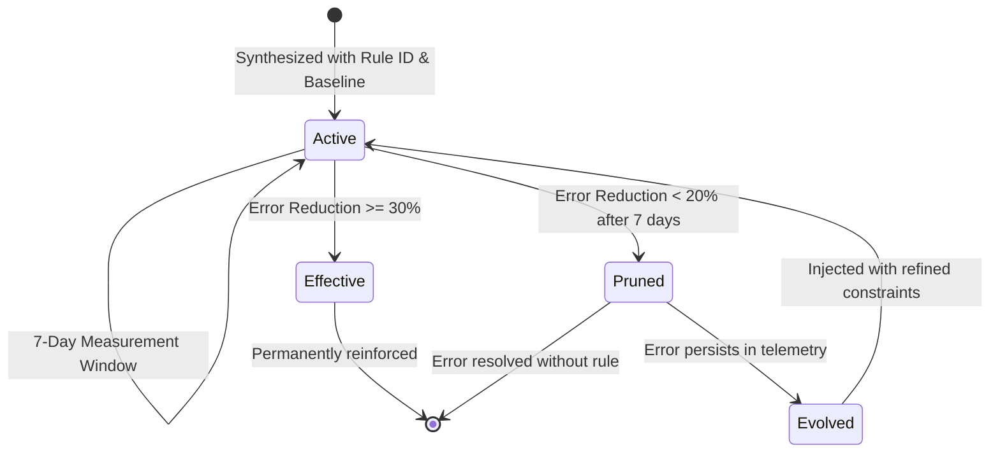

<div align="center">



# AGENT-CI: Autonomous Continuous Improvement Pipeline for AI Coding Agents

[](CHANGELOG.md)
[](LICENSE)
[](https://www.python.org/downloads/)
[](#)
[](CONTRIBUTING.md)

**Turn session telemetry into automated agent evolution, self-healing guardrails, and regression-proof skill maintenance.**

[Key Features](#key-features) • [Prerequisites](#prerequisites--telemetry-accumulation) • [Quickstart](#quickstart) • [Architecture](#-7-phase-pipeline-architecture) • [Scoring & Efficacy](#-scoring-formulation--rule-efficacy-lifecycle) • [Documentation](ARCHITECTURE.md)

</div>

---

## 💡 Overview

**AGENT-CI** is an autonomous, closed-loop continuous improvement system designed for AI coding agents (such as Google Antigravity, Claude Code, Gemini CLI, and open-source agentic harnesses). 

Rather than relying on manual prompt tweaking or ad-hoc system prompt changes, **AGENT-CI** operates like a traditional CI/CD compiler and test runner for agent behavior:
1. It continuously monitors execution logs for tool loops, fatal timeouts, and user corrections.
2. Dynamically maps active project workspaces and manages skill dependencies (including Git upstreams, NPX packages, and symlinks).
3. Computes normalized composite health scores across project scopes.
4. Synthesizes targeted behavioral guardrails, automatically pruning ineffective rules and evolving alternatives.
5. Runs automated verification test suites with instant rollback (`git revert`) on regression.
6. Publishes visual executive audit reports mirrored into Obsidian knowledge vaults.

---

## ✨ Key Features

- 🔄 **7-Phase Closed-Loop Pipeline**: From auto-discovery to telemetry parsing, score calculation, upstream sync, rule synthesis, eval verification, and reporting.
- 🎯 **Rule Efficacy Lifecycle**: Tracks newly applied guardrails with unique rule IDs and baseline error frequencies. Ineffective rules (<20% error reduction after 7 days) are automatically pruned to prevent prompt bloat; persistent errors trigger rule evolution.
- 📊 **Composite Health Score & Learning Rate**: Quantifies agent performance on a 0.0 to 1.0 scale, combining Health Rate, Tool Loop Inversion, Correction Inversion, Upstream Freshness, and a dynamic Learning Rate metric.
- 🛡️ **Regression Guard & Auto-Revert**: Automatically tests modified skills against evaluation suites. If performance drops by >5%, AGENT-CI executes an immediate atomic rollback (`git revert --no-edit HEAD`) and tags the incident.
- 🧩 **Multi-Workspace & Install-Type Discovery**: Automatically parses session logs to detect active workspaces and categorizes skills across symlinks, NPX packages, system binaries, and local repositories.
- 📓 **Obsidian Dashboard Mirroring**: Publishes rich markdown audit reports and updates a real-time Obsidian dashboard (`OBSIDIAN_DASHBOARD.md`) complete with callouts and visual status indicators.

---

## ⚠️ Prerequisites & Telemetry Accumulation

> [!IMPORTANT]
> **AGENT-CI analyzes empirical session telemetry.**
>
> The continuous improvement engine relies on real-world execution logs (`*.jsonl` and `*.md`) to detect failure patterns, repeated tool loops, and user corrections. 
>
> **Before triggering a production CI cycle:**
> 1. Ensure your AI coding agent (e.g., Antigravity, Claude, or Gemini) is actively used for development.
> 2. Allow logs to accumulate in `~/.agents/logs/` (or your configured log directory).
> 3. Once several interactive sessions or coding tasks have run, trigger AGENT-CI to audit performance and synthesize guardrails.
>
> *Running AGENT-CI with an empty log directory will safely detect 0 sessions and maintain existing baselines.*

---

## 🚀 Quickstart

### Option A: Complete 1-Run Live Production Cycle

Execute the complete 7-phase pipeline sequentially:

```bash
# Phase 0: Auto-discover workspaces & skills across session logs
python3 scripts/discover_skills.py \
  --output ~/.agents/project-skill-map.json

# Phase 1: Parse and batch logs with failure signature extraction
python3 scripts/parse_logs.py \
  --batch-size 10 \
  --skip-audited \
  --mark-audited \
  --archive-dir ~/.agents/logs/archived \
  --output /tmp/agent_ci_telem.json

# Phase 2: Compute composite scores, rule efficacy & score deltas
python3 scripts/score_engine.py \
  --telemetry /tmp/agent_ci_telem.json \
  --registry ~/.agents/project-skill-map.json \
  --history ~/.agents/score_history.json \
  --rule-ledger ~/.agents/rule_ledger.json

# Phase 3: Check upstream currency for Git, NPX, and symlinked skills
python3 scripts/check_upstream.py \
  --lock-file ~/.agents/.skill-lock.json \
  --registry ~/.agents/project-skill-map.json \
  --output /tmp/agent_ci_upstream.json

# Phase 4: Apply updates, synthesize rules, prune stale guards, tag commit
python3 scripts/apply_improvements.py \
  --telemetry /tmp/agent_ci_telem.json \
  --registry ~/.agents/project-skill-map.json \
  --scores ~/.agents/score_history.json \
  --upstream /tmp/agent_ci_upstream.json \
  --rule-ledger ~/.agents/rule_ledger.json \
  --output-json /tmp/agent_ci_changes.json

# Phase 5: Execute evaluation suites with automated regression rollback
python3 scripts/verify_improvements.py \
  --changes /tmp/agent_ci_changes.json \
  --history ~/.agents/score_history.json \
  --rule-ledger ~/.agents/rule_ledger.json \
  --output-json /tmp/agent_ci_verify.json

# Phase 6: Compile executive audit report & mirror to Obsidian
python3 scripts/generate_report.py \
  --telemetry /tmp/agent_ci_telem.json \
  --scores ~/.agents/score_history.json \
  --upstream /tmp/agent_ci_upstream.json \
  --changes /tmp/agent_ci_changes.json \
  --verification /tmp/agent_ci_verify.json \
  --rule-ledger ~/.agents/rule_ledger.json \
  --mirror-obsidian
```

---

### Option B: Safe Dry-Run Simulation

Preview all detections, score computations, proposed rule injections, and evaluation checks without writing files, committing to Git, or rolling back state:

```bash
# Auto-discover into temporary test registry
python3 scripts/discover_skills.py --output /tmp/dryrun_registry.json

# Parse logs without marking them audited
python3 scripts/parse_logs.py --batch-size 5 --skip-audited --output /tmp/dryrun_telem.json

# Compute scores and preview learning rate
python3 scripts/score_engine.py \
  --telemetry /tmp/dryrun_telem.json \
  --registry /tmp/dryrun_registry.json \
  --history ~/.agents/score_history.json \
  --rule-ledger ~/.agents/rule_ledger.json

# Check upstream status
python3 scripts/check_upstream.py \
  --lock-file ~/.agents/.skill-lock.json \
  --registry /tmp/dryrun_registry.json \
  --output /tmp/dryrun_upstream.json

# Preview rule synthesis and pruning in dry-run mode
python3 scripts/apply_improvements.py \
  --dry-run \
  --telemetry /tmp/dryrun_telem.json \
  --registry /tmp/dryrun_registry.json \
  --scores ~/.agents/score_history.json \
  --upstream /tmp/dryrun_upstream.json \
  --rule-ledger ~/.agents/rule_ledger.json \
  --output-json /tmp/dryrun_changes.json

# Simulate test verification without triggering git revert
python3 scripts/verify_improvements.py \
  --dry-run \
  --changes /tmp/dryrun_changes.json \
  --history ~/.agents/score_history.json \
  --rule-ledger ~/.agents/rule_ledger.json \
  --output-json /tmp/dryrun_verify.json

# Generate report and preview dashboard
python3 scripts/generate_report.py \
  --telemetry /tmp/dryrun_telem.json \
  --scores ~/.agents/score_history.json \
  --upstream /tmp/dryrun_upstream.json \
  --changes /tmp/dryrun_changes.json \
  --verification /tmp/dryrun_verify.json \
  --rule-ledger ~/.agents/rule_ledger.json \
  --mirror-obsidian
```

---

### Option C: Automated Scheduling via `/schedule`

Configure your agent harness to run AGENT-CI automatically on a daily schedule (e.g., every morning at 06:00 AM) using a fast, cost-effective model:

```bash
/schedule CronExpression="0 6 * * *" Prompt="Execute agent-ci v2.1 autonomous pipeline: run discover_skills to update registry, parse_logs with adaptive batching, compute score_engine composite scores with rule ledger, check_upstream skill currency, apply_improvements for updates and rule lifecycle (apply, prune, evolve), verify_improvements with auto-revert, and generate_report with Obsidian mirroring. Alert user only if regressions or critical errors occur." IsDaemon=true
```

---

## 🏛️ 7-Phase Pipeline Architecture

<div align="center">



</div>

| Phase | Script | Primary Responsibility | Key Inputs & Outputs |
| :--- | :--- | :--- | :--- |
| **Phase 0** | [`discover_skills.py`](scripts/discover_skills.py) | **Auto-Discovery**: Scans session logs to detect active workspaces; classifies skills as `symlink`, `npx`, `system`, or `local`; merges with manual mappings. | Out: `project-skill-map.json` |
| **Phase 1** | [`parse_logs.py`](scripts/parse_logs.py) | **Log Audit**: Ingests JSONL and Markdown logs with adaptive batching (5–20); extracts Level A (crashes/timeouts), B (friction/loops), and C (user corrections). | Out: `/tmp/agent_ci_telemetry.json` |
| **Phase 2** | [`score_engine.py`](scripts/score_engine.py) | **Score Engine**: Computes normalized Composite Health Score (0.0–1.0) and Learning Rate per project scope; tracks cycle deltas. | Out: `score_history.json` |
| **Phase 3** | [`check_upstream.py`](scripts/check_upstream.py) | **Upstream Check**: Checks remote Git repositories (`ls-remote`), NPX packages, and symlinks with caching and timeout resiliency. | Out: `/tmp/agent_ci_upstream.json` |
| **Phase 4** | [`apply_improvements.py`](scripts/apply_improvements.py) | **Apply & Hardening**: Fast-forwards upstream skills; generates loop guards, pre-flight checks, and scope alignment gates; prunes ineffective rules; tags atomic git commit (`ci/YYYY-MM-DD`). | In/Out: `rule_ledger.json`, git commit/tag |
| **Phase 5** | [`verify_improvements.py`](scripts/verify_improvements.py) | **Verification & Auto-Revert**: Runs automated evaluation suites (`evals.json`, unit tests); triggers automated `git revert HEAD` if score drops >5%. | Out: `/tmp/agent_ci_verification.json` |
| **Phase 6** | [`generate_report.py`](scripts/generate_report.py) | **Reporting & Archive**: Generates executive markdown audit reports (`REPORT_YYYY-MM-DD_HH-mm.md`), mirrors to Obsidian vault (`OBSIDIAN_DASHBOARD.md`), archives processed logs. | Out: `agent-ci-reports/` |

---

## 📈 Scoring Formulation & Rule Efficacy Lifecycle

### Composite Health Score Formula

AGENT-CI v2.1 computes a weighted multi-dimensional score $S \in [0.0, 1.0]$ for each project scope:

$$\text{Score} = 0.30H + 0.25(1 - L) + 0.15(1 - C) + 0.10F + 0.20R$$

| Component | Metric | Definition | Description |
| :---: | :--- | :--- | :--- |
| **$H$** | **Health Rate** | $\frac{\text{healthy\_sessions}}{\text{total\_sessions}}$ | Proportion of sessions terminating without Level A or B failures. |
| **$L$** | **Loop Rate** | $\frac{\text{looping\_sessions}}{\text{total\_sessions}}$ | Sessions exhibiting $\ge 3$ repeated identical tool invocations. |
| **$C$** | **Correction Rate** | $\frac{\text{corrected\_sessions}}{\text{total\_sessions}}$ | Sessions containing user intervention markers (*"salah"*, *"retry"*). |
| **$F$** | **Upstream Freshness** | $\frac{\text{current\_skills}}{\text{total\_tracked\_skills}}$ | Proportion of installed skills matching upstream repository heads. |
| **$R$** | **Learning Rate** | $\frac{\text{effective\_rules}}{\text{active\_rules}}$ | Ratio of synthesized rules that reduced error frequencies by $\ge 30\%$. |

### Rule Efficacy Lifecycle State Machine

To prevent prompt pollution and ensure agents remain nimble, every synthesized rule follows a strict lifecycle:



- **Active**: Rule is recorded in `rule_ledger.json` with baseline error counts and injected into system instructions (`GEMINI.md` or `SKILL.md`).
- **Effective**: If the error frequency drops by $\ge 30\%$, the rule is classified as effective and maintained.
- **Pruned**: If after 7 days the error reduction is $< 20\%$, the rule is automatically excised from the instruction file to prevent prompt bloat.
- **Evolved**: If an error continues to appear after pruning, AGENT-CI synthesizes an alternative rule with stricter preconditions or alternative tool recommendations.

---

## 📁 Repository Layout

```
AGENT-CI/
├── .github/                      # GitHub Actions workflows & templates
│   ├── workflows/ci.yml          # Automated test & syntax validation
│   ├── ISSUE_TEMPLATE/           # Structured bug and feature templates
│   └── pull_request_template.md  # Standard pull request checklist
├── assets/                       # Vector illustrations & documentation diagrams
│   ├── hero-banner.svg           # High-contrast hero banner
│   └── pipeline-diagram.svg      # 7-phase architecture diagram
├── evals/                        # Skill evaluation suite & sample baselines
│   └── evals.json                # Benchmark prompts and evaluation assertions
├── scripts/                      # Core 7-phase pipeline engines
│   ├── discover_skills.py        # Phase 0: Auto-discovery engine
│   ├── parse_logs.py             # Phase 1: High-density log parser
│   ├── score_engine.py           # Phase 2: Composite scoring engine
│   ├── check_upstream.py         # Phase 3: Upstream Git/NPX/Symlink auditor
│   ├── apply_improvements.py     # Phase 4: Rule synthesis & lifecycle engine
│   ├── verify_improvements.py    # Phase 5: Automated eval runner & auto-revert
│   └── generate_report.py        # Phase 6: Report compiler & Obsidian mirror
├── ARCHITECTURE.md               # Technical specification & JSON schemas
├── CHANGELOG.md                  # Release history and version updates
├── CODE_OF_CONDUCT.md            # Contributor Covenant Code of Conduct
├── CONTRIBUTING.md               # Contribution guidelines & coding standards
├── LICENSE                       # MIT License (Raymond Alexander Yonathan)
├── README.md                     # Repository overview & quickstart guide
├── SECURITY.md                   # Security vulnerability reporting policy
└── SKILL.md                      # Agent skill specification for AI harnesses
```

---

## 🤝 Community & Governance

- 📖 **Architecture & Deep Dive**: [ARCHITECTURE.md](ARCHITECTURE.md)
- 🛠️ **Contributing Guide**: [CONTRIBUTING.md](CONTRIBUTING.md)
- 📜 **Code of Conduct**: [CODE_OF_CONDUCT.md](CODE_OF_CONDUCT.md)
- 🔒 **Security Policy**: [SECURITY.md](SECURITY.md)
- 📝 **Changelog**: [CHANGELOG.md](CHANGELOG.md)

---

## 📄 License

This project is licensed under the **MIT License** — see the [LICENSE](LICENSE) file for details.

Copyright (c) 2026 **Raymond Alexander Yonathan** ([@Mantaray91](https://github.com/Mantaray91)).
