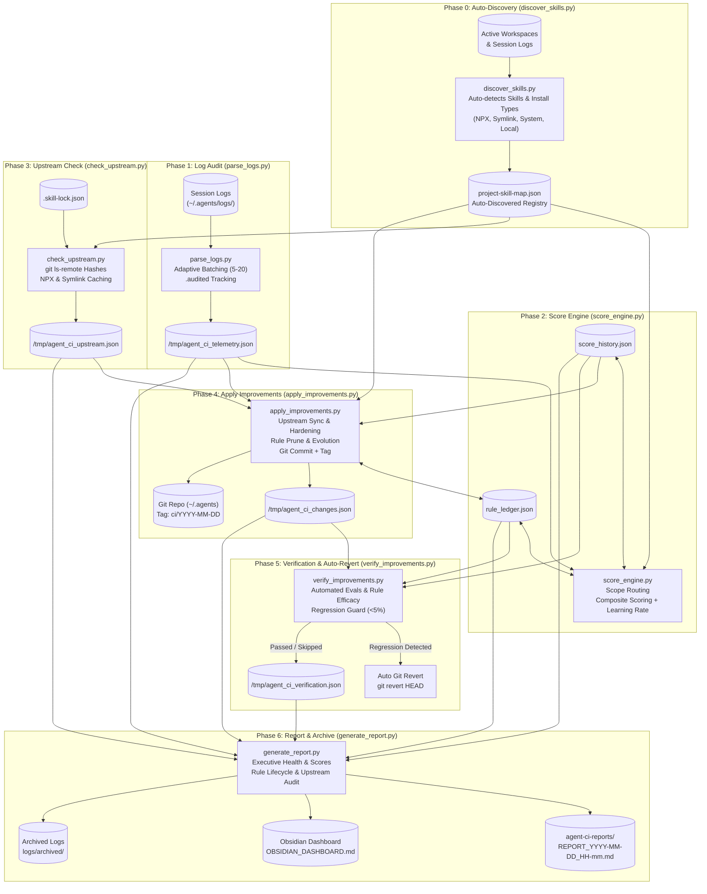
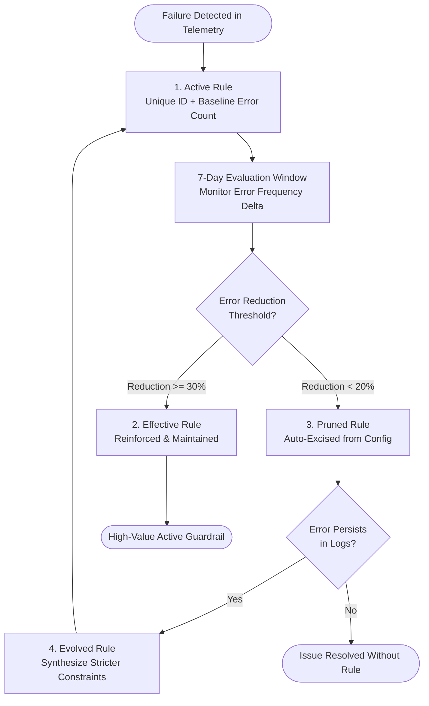

# Agent Continuous Improvement (`agent-ci`) v2.1.1

An autonomous, closed-loop self-improving pipeline for AI coding agents. `agent-ci` ingests multi-source execution logs, auto-discovers skills across active workspaces, evaluates agent performance across project scopes, tracks upstream skill freshness (including symlinked and NPX skills), synthesizes targeted hardening patches with full rule efficacy lifecycle management (auto-pruning ineffective rules and evolving alternatives), verifies changes against automated evaluation suites with automatic regression rollback, and publishes visual health dashboards mirrored to Obsidian.

---

## 🏗️ Architecture & 7-Phase Pipeline

`agent-ci` operates as an end-to-end, multi-phase continuous integration loop across 7 autonomous phases:



---

### Phase Breakdown

#### Phase 0: Auto-Discovery (`discover_skills.py`)
- **Telemetry-Driven Discovery**: Scans session logs (`~/.agents/logs/`) to dynamically identify active project workspaces without requiring manual registration.
- **Install Type Classification**: Inspects skill installations across workspaces and global directories, classifying them into:
  - `symlink`: Resolves filesystem symlinks back to parent Git repositories and extracts remote URLs.
  - `npx`: Recognizes Node/NPX execution wrappers and tool packages.
  - `system`: Identifies system-installed binaries and system-managed tools.
  - `local`: Flags locally authored, standalone project skills.
- **Dynamic Registry Generation**: Generates or updates `~/.agents/project-skill-map.json` while strictly preserving existing user-defined manual mappings (`"source": "manual"`).
- **Scope Pattern Matching**: Derives project scope identifiers (e.g., `web-backend`, `data-pipeline`, `mobile-app`, `global`) and matching regex patterns.

#### Phase 1: Log Audit (`parse_logs.py`)
- **Telemetry Ingestion**: Scans structured JSON Lines logs (`logs/*.jsonl`) and Markdown logs (`logs/*.md`) from CLI and Chat-Agentic sessions.
- **Adaptive Batching**: Processes sessions in bounded batches (`--batch-size N`, default: 10, max: 20) to maintain low token consumption and avoid context bloat.
- **Deduplication & Audited Tracking**: Flags processed files with `.audited` (`--mark-audited` / `--skip-audited`) or moves them to `--archive-dir` to prevent redundant processing.
- **Failure Categorization**:
  - **Level A (Fatal Crashes & Timeouts)**: Unhandled terminations, syntax crashes, process deadlocks (`AbnormalTermination`, `ToolTimeout`).
  - **Level B (Friction & Loops)**: Repeated identical tool calls ($\ge 3$), missing file probes, recurring tool errors.
  - **Level C (Outcome Misalignment)**: User correction patterns (*"salah"*, *"bukan itu"*, *"ulangi"*, *"stop"*).
- **Scope Mapping**: Labels sessions using project markers or registry regex patterns.

#### Phase 2: Score Engine (`score_engine.py`)
- **Scope Routing**: Routes sessions into discrete project scopes based on the auto-discovered `project-skill-map.json`.
- **Composite Scoring Formulation (v2.1)**: Computes a normalized score $S \in [0.0, 1.0]$:
  $$Score = 0.30H + 0.25(1-L) + 0.15(1-C) + 0.10F + 0.20R$$
  Where:
  - $H$ = **Health Rate** ($\frac{\text{healthy\_sessions}}{\text{total\_sessions}}$)
  - $L$ = **Loop Rate** ($\frac{\text{looping\_sessions}}{\text{total\_sessions}}$)
  - $C$ = **Correction Rate** ($\frac{\text{corrected\_sessions}}{\text{total\_sessions}}$)
  - $F$ = **Upstream Freshness** ($\frac{\text{current\_skills}}{\text{total\_tracked\_skills}}$)
  - $R$ = **Learning Rate** ($\frac{\text{effective\_rules}}{\text{active\_rules}}$, default 1.0 if no active rules)
- **Delta Tracking**: Calculates delta against the preceding cycle from `score_history.json` and flags positive progress (🟢) or regression alerts (🔴).
- **Rule Efficacy Integration**: Reads `~/.agents/rule_ledger.json` to calculate the learning rate metric and monitor rule lifecycle progress.

#### Phase 3: Upstream Check (`check_upstream.py`)
- **Lockfile & Registry Comparison**: Reads installed skills from `~/.agents/.skill-lock.json` and the auto-discovered registry.
- **Symlink & NPX Support**: Resolves symlink targets to their Git repository root, utilizing per-repository remote hash caching to prevent redundant network round-trips. Categorizes system and NPX tools appropriately as `SYSTEM_MANAGED`.
- **Git Option & Protocol Injection Defense**: Validates repository URLs via `is_valid_git_url()` against option injection flags (`--upload-pack`, `-u`), blocks dangerous schemes (`ext::`, `file://`), and enforces `--` argument separators across git commands.
- **Status Categories**:
  - `CURRENT`: Installed skill hash matches remote upstream.
  - `UPDATE_AVAILABLE`: New commits exist upstream.
  - `LOCAL_ONLY`: Skill is locally authored (no remote repository).
  - `SYSTEM_MANAGED`: System or NPX package without a direct git upstream.
  - `CHECK_FAILED`: Network or authentication failure during check.
- **Timeout Resiliency**: Enforces non-blocking timeouts (`--timeout 10`) per repository.

#### Phase 4: Apply Improvements (`apply_improvements.py`)
- **Autonomous Upstream Sync**: Fetches and fast-forwards skills flagged with `UPDATE_AVAILABLE`.
- **Prompt Injection & Path Traversal Guards**: Sanitizes error/scope tokens with `_sanitize_token()` (stripping newlines, backticks, and HTML tags) before synthesizing rules; validates target paths against `allowed_roots` to prevent directory traversal.
- **Selective File Staging**: Stages only explicitly modified rule files and ledger updates (`files_to_stage`) instead of blind staging (`git add -A`), keeping untracked secrets and dirty workspace state out of git history.
- **Telemetry-Driven Hardening**: Generates targeted rule enhancements:
  - `LOOP_GUARDS`: Injects thrashing prevention rules for overused tools.
  - `PRE_FLIGHT_CHECKS`: Injects verification requirements for tools prone to crashes or timeouts.
  - `SCOPE_ALIGNMENT`: Injects clarification and confirmation gates (`grill-me`) for repeated user corrections.
- **Rule Efficacy Lifecycle Management**:
  - Assigns unique rule IDs (e.g. `RULE-LOOP-run_command-001`, `RULE-PREFLIGHT-AbnormalTermination-001`) and records baseline error frequencies in `~/.agents/rule_ledger.json`.
  - **Efficacy Measurement**: Compares current error occurrences against baseline over a 7-day evaluation window:
    $$\text{efficacy} = \frac{\text{baseline\_frequency} - \text{current\_frequency}}{\text{baseline\_frequency}}$$
  - **Effective Rules ($\ge 30\%$ reduction)**: Maintained as active and reinforced.
  - **Ineffective Rules ($< 20\%$ reduction after 7 days)**: Automatically pruned and excised from target files (`GEMINI.md`, `SKILL.md`), and marked as `PRUNED` in `rule_ledger.json`.
  - **Rule Evolution**: If an ineffective rule is pruned but the error persists in telemetry, an evolved alternative rule with refined or stricter constraints is synthesized.
- **Atomic Commits & Tagging**: Commits changes to the target repository and creates an annotated git tag: `ci/YYYY-MM-DD`.
- **Safe Dry-Run**: Supports `--dry-run` to preview all actions without modifying files or git state.

#### Phase 5: Verification & Auto-Revert (`verify_improvements.py`)
- **Safe Static AST Verification**: Defaults to static AST syntax inspection (`ast.parse`) for Python test files to eliminate arbitrary code execution (RCE) from untrusted skill test suites. Supports `--allow-code-eval` for explicit dynamic test execution.
- **Automated Skill Evals & Path Traversal Guard**: Executes evaluation suites (`evals/evals.json`) with strict `is_relative_to()` directory boundary enforcement on all assertion file targets.
- **Rule Lifecycle Check**: Validates active rules and calculates learning rate metrics.
- **Regression Guard & Manual Commit Protection**: Compares post-patch pass rates against baselines. If regression exceeds the allowable threshold (`--eval-threshold 0.05` / 5% drop):
  - Validates HEAD commit message to ensure it is an automated CI commit before executing rollback, refusing to revert manual user commits.
  - Automatically executes `git revert --no-edit HEAD` when verified.
  - Tags the rollback event (`ci/YYYY-MM-DD-reverted`).
  - Logs critical caution alert in the verification output.
- **Dry-Run Safe**: Runs evaluation previews without executing git revert when `--dry-run` is active.

#### Phase 6: Report & Archive (`generate_report.py`)
- **Comprehensive Audit Report**: Compiles executive health summaries, composite scores, rule efficacy lifecycle table, pruned rules log, upstream currency, applied patches, and verification results into `~/.agents/agent-ci-reports/REPORT_YYYY-MM-DD_HH-mm.md`.
- **Obsidian Dashboard Mirroring**: Generates a centralized overview with Obsidian callouts, progress bars, and navigation links at `agent-ci-reports/OBSIDIAN_DASHBOARD.md`.
- **Log Lifecycle Management**: Moves audited logs to `logs/archived/` to ensure workspace cleanliness.

---

## 📈 Learning Rate & Rule Efficacy Lifecycle

Agent CI v2.1 introduces a closed-loop rule efficacy lifecycle to prevent instruction bloat and ensure only high-value rules persist:



### Learning Rate Metric ($R$)
The Learning Rate represents the proportion of CI-applied rules that demonstrably improve agent behavior:
$$\text{learning\_rate} = \frac{\text{effective\_rules}}{\text{total\_active\_rules}}$$

- **Range**: $[0.0, 1.0]$ (defaults to $1.0$ if no rules are currently active).
- **Incentive Alignment**: Incorporating $R$ into the composite score ($20\%$ weight) penalizes shotgun prompt engineering and rewards concise, effective guardrails.

---

## ⏰ Automated Scheduling

`agent-ci` is designed to run completely autonomously on a recurring schedule using a lightweight, fast model (`gemini-2.5-flash`).

### Setting Up the Daily Cron Task
To configure autonomous execution every day at 06:00 AM:

```bash
/schedule CronExpression="0 6 * * *" Prompt="Execute agent-ci v2.1 autonomous pipeline: run discover_skills to update registry, parse_logs with adaptive batching, compute score_engine composite scores with rule ledger, check_upstream skill currency, apply_improvements for updates and rule lifecycle (apply, prune, evolve), verify_improvements with auto-revert, and generate_report with Obsidian mirroring. Alert user only if regressions or critical errors occur." IsDaemon=true
```

> [!TIP]
> Always execute the scheduled pipeline using the `flash` model tier to keep execution costs minimal and speed high. Reserve frontier models for active interactive development.

---

## 💻 On-Demand Execution Guide

You can trigger the pipeline manually at any time via CLI or through agent prompts (e.g., *"run agent-ci"*, *"audit agent logs"*, *"check skill improvements"*).

### 1. Full Live Run (Production Cycle)
Runs the end-to-end 7-phase pipeline, discovers skills, applies hardening patches, prunes ineffective rules, commits changes, verifies against evals, and writes reports:

```bash
# Phase 0: Discover workspaces and skills
python3 ~/.agents/skills/agent-ci/scripts/discover_skills.py \
  --output ~/.agents/project-skill-map.json

# Phase 1: Parse and batch logs
python3 ~/.agents/skills/agent-ci/scripts/parse_logs.py \
  --batch-size 10 \
  --skip-audited \
  --mark-audited \
  --archive-dir ~/.agents/logs/archived \
  --output /tmp/agent_ci_telem.json

# Phase 2: Compute composite scores, rule efficacy & deltas
python3 ~/.agents/skills/agent-ci/scripts/score_engine.py \
  --telemetry /tmp/agent_ci_telem.json \
  --registry ~/.agents/project-skill-map.json \
  --history ~/.agents/score_history.json \
  --rule-ledger ~/.agents/rule_ledger.json

# Phase 3: Check upstream updates (Git, NPX, Symlinks)
python3 ~/.agents/skills/agent-ci/scripts/check_upstream.py \
  --lock-file ~/.agents/.skill-lock.json \
  --registry ~/.agents/project-skill-map.json \
  --output /tmp/agent_ci_upstream.json

# Phase 4: Apply improvements, prune ineffective rules & create tagged commit
python3 ~/.agents/skills/agent-ci/scripts/apply_improvements.py \
  --telemetry /tmp/agent_ci_telem.json \
  --registry ~/.agents/project-skill-map.json \
  --scores ~/.agents/score_history.json \
  --upstream /tmp/agent_ci_upstream.json \
  --rule-ledger ~/.agents/rule_ledger.json \
  --output-json /tmp/agent_ci_changes.json

# Phase 5: Verify changes with auto-revert guard & eval suites
python3 ~/.agents/skills/agent-ci/scripts/verify_improvements.py \
  --changes /tmp/agent_ci_changes.json \
  --history ~/.agents/score_history.json \
  --rule-ledger ~/.agents/rule_ledger.json \
  --output-json /tmp/agent_ci_verify.json

# Phase 6: Compile CI report & mirror Obsidian dashboard
python3 ~/.agents/skills/agent-ci/scripts/generate_report.py \
  --telemetry /tmp/agent_ci_telem.json \
  --scores ~/.agents/score_history.json \
  --upstream /tmp/agent_ci_upstream.json \
  --changes /tmp/agent_ci_changes.json \
  --verification /tmp/agent_ci_verify.json \
  --rule-ledger ~/.agents/rule_ledger.json \
  --mirror-obsidian
```

### 2. Full Dry-Run Cycle (Safe Simulation)
Simulates all 7 phases without modifying configuration files, creating git commits, or triggering git reverts:

```bash
# Phase 0: Auto-discover skills into temporary registry
python3 ~/.agents/skills/agent-ci/scripts/discover_skills.py \
  --output /tmp/e2e_registry.json

# Phase 1: Parse logs without marking as audited
python3 ~/.agents/skills/agent-ci/scripts/parse_logs.py \
  --batch-size 5 \
  --skip-audited \
  --output /tmp/e2e_telem.json

# Phase 2: Compute scores and preview learning rate
python3 ~/.agents/skills/agent-ci/scripts/score_engine.py \
  --telemetry /tmp/e2e_telem.json \
  --registry /tmp/e2e_registry.json \
  --history ~/.agents/score_history.json \
  --rule-ledger ~/.agents/rule_ledger.json

# Phase 3: Check upstream status
python3 ~/.agents/skills/agent-ci/scripts/check_upstream.py \
  --lock-file ~/.agents/.skill-lock.json \
  --registry /tmp/e2e_registry.json \
  --output /tmp/e2e_upstream.json

# Phase 4: Preview improvements, pruning and evolution (dry-run mode)
python3 ~/.agents/skills/agent-ci/scripts/apply_improvements.py \
  --dry-run \
  --telemetry /tmp/e2e_telem.json \
  --registry /tmp/e2e_registry.json \
  --scores ~/.agents/score_history.json \
  --upstream /tmp/e2e_upstream.json \
  --rule-ledger ~/.agents/rule_ledger.json \
  --output-json /tmp/e2e_changes.json

# Phase 5: Simulate verification and evals (dry-run mode)
python3 ~/.agents/skills/agent-ci/scripts/verify_improvements.py \
  --dry-run \
  --changes /tmp/e2e_changes.json \
  --history ~/.agents/score_history.json \
  --rule-ledger ~/.agents/rule_ledger.json \
  --output-json /tmp/e2e_verify.json

# Phase 6: Generate report and dashboard
python3 ~/.agents/skills/agent-ci/scripts/generate_report.py \
  --telemetry /tmp/e2e_telem.json \
  --scores ~/.agents/score_history.json \
  --upstream /tmp/e2e_upstream.json \
  --changes /tmp/e2e_changes.json \
  --verification /tmp/e2e_verify.json \
  --rule-ledger ~/.agents/rule_ledger.json \
  --mirror-obsidian
```

### 3. Filtered Execution by Project Scope
To run analysis targeting a single project scope (e.g. `REVIT`):

```bash
python3 ~/.agents/skills/agent-ci/scripts/parse_logs.py --filter REVIT --output /tmp/revit_telem.json
python3 ~/.agents/skills/agent-ci/scripts/generate_report.py --telemetry /tmp/revit_telem.json
```

---

## 📁 State Files Reference

The continuous improvement pipeline relies on and maintains the following state files:

| File Path | Managed By | Purpose |
| :--- | :--- | :--- |
| `~/.agents/rule_ledger.json` | `apply_improvements.py` / `score_engine.py` | Full rule lifecycle ledger tracking active rules, baselines, measurements, pruned rules, and evolved alternatives. |
| `~/.agents/project-skill-map.json` | `discover_skills.py` | Auto-discovered registry mapping workspace folder patterns to project scopes and associated skills (preserves manual mappings). |
| `~/.agents/score_history.json` | `score_engine.py` | Historical record of composite scores, metric components, session counts, and deltas per project scope. |
| `~/.agents/.skill-lock.json` | Skill Manager / `check_upstream.py` | Lockfile tracking all installed skills, git repository URLs, tracked branches, and commit hashes. |
| `~/.agents/logs/archived/` | `parse_logs.py` / CI | Archive directory containing processed session logs (`*.audited`) separated from active logs. |
| `~/.agents/agent-ci-reports/` | `generate_report.py` | Historical markdown audit reports (`REPORT_YYYY-MM-DD_HH-mm.md`) and the live `OBSIDIAN_DASHBOARD.md`. |

---

## 🛡️ Safety, Rollback & Recovery Guide

`agent-ci` is architected with defense-in-depth safety controls to prevent unintended modifications or degradation of skills.

### 1. Tagged Commit Traceability
Every autonomous modification executed by `apply_improvements.py` generates a single atomic git commit with a standard tag:
- **Format**: `ci/YYYY-MM-DD` (e.g., `ci/2026-09-09`)
- **Commit Message**: `ci(agent): apply autonomous improvements [ci/YYYY-MM-DD]`

### 2. Automated Regression Revert
During Phase 5, `verify_improvements.py` immediately validates modified skills against their evaluation baselines:
- If pass rate degradation exceeds `5%` (`--eval-threshold 0.05`), an automatic git revert is executed:
  ```bash
  git revert --no-edit HEAD
  git tag ci/YYYY-MM-DD-reverted
  ```
- The incident is documented with a `[!CAUTION]` alert in the generated report.

### 3. Rule Lifecycle Pruning & Evolution Safety
- Rules are tracked with unique IDs and explicit baseline metrics.
- Ineffective rules are never left to accumulate; they are cleanly removed after 7 days if efficacy is under 20%.
- Evolved rules are generated as refined alternatives, preventing endless regression cycles while ensuring unsolved errors receive targeted guidance.

### 4. Manual Rollback Procedure
If you need to manually inspect or roll back an autonomous update:

```bash
cd ~/.agents

# 1. View recent CI tags and commit log
git tag -l "ci/*"
git log -n 5 --oneline

# 2. Inspect changes introduced by a specific CI tag
git show ci/2026-09-09

# 3. Cleanly revert the CI commit
git revert --no-edit ci/2026-09-09

# 4. Alternatively, reset hard to the commit immediately prior to the CI tag (if unpushed)
git reset --hard ci/2026-09-09~1
```

### 5. Runtime Security & Injection Defenses (v2.1.1)
`agent-ci` incorporates active security defenses against untrusted repositories and prompt poisoning:
- **Git Option & Protocol Injection Mitigation**: Rejects flags (`--upload-pack`, `-u`) and protocols like `ext::` or `file://`; injects `--` command separators across all git subprocess commands.
- **Prompt Injection / Rule Poisoning Sanitization**: Sanitizes tokens via `_sanitize_token()` (stripping newlines, markdown fences, HTML/XML tags) before creating rule definitions.
- **Safe Static AST Verification**: Defaults to static AST validation (`ast.parse`) for Python tests, completely eliminating code execution risks from untrusted eval suites unless `--allow-code-eval` is explicitly passed.
- **Path Traversal Guard**: Enforces `allowed_roots` validation in `apply_patch_to_file()` and checks all eval targets with `is_relative_to()`.
- **Manual Commit Protection**: Verifies commit message format before `auto_revert` triggers, refusing to rollback commits made manually by human developers.
